# Overview


## Guiding Principles

>[!TIP] "There are no solutions, only tradeoffs"

1. Apply a Compound AI approach
   1. Using non-AI tools and AI tools together to complement each other
   2. Use deterministic workflows where possible
2. Pre-Process where possible e.g.
   1. Extract KeyPhrases
   2. Get Reference Content
3. Loose Coupling High Cohesion
   1. Separate the getting of CVE Info (deterministic) from the CWE assignment (LLM)
4. Explainability
   1. Store the input and output data to/from the LLM for later review

## Building Blocks
- Check for Twin CVEs (in Observed, Top25) - https://github.com/CyberSecAI/cve_dedup/blob/main/cve_similarities.csv
- GetDescription - https://github.com/CyberSecAI/cve_info this is sanitized already
- GetKeyPhrases - https://github.com/CyberSecAI/cve_info
- GetReferenceContent - https://github.com/CyberSecAI/cve_reference_link_crawler


# Architecture

### Get CVE Info


### Assign CWE(s)

```mermaid
stateDiagram-v2
[*] --> GET_CVE_ID: Start
GET_CVE_ID --> GET_CVE_INFO
GET_CVE_INFO --> ASSIGN_CWES🤖

ASSIGN_CWES🤖 --> GET_CWE_ATTRIBUTES
ASSIGN_CWES🤖 --> GET_CWE_VULN_MAPPING_NOTES



GET_CWE_ATTRIBUTES --> CREATE_REPORT 
GET_CWE_VULN_MAPPING_NOTES --> CREATE_REPORT: FAQs, RCMWG meeting notes guidance

CREATE_REPORT --> REVIEW_REPORT🤖
REVIEW_REPORT🤖 --> ASSIGN_CWES🤖: Needs improvement
REVIEW_REPORT🤖 --> PUBLISH_CWE_ASSIGNMENT: Analysis complete
PUBLISH_CWE_ASSIGNMENT --> [*]: End
```




## Hybrid RAG Architecture for CWE Knowledge


### Batch Review CWE Assignment

LLM-As-a-Judge to review all results.


### Benchmark Results against Top25


# Target Of Evaluation
1. [2023 CWE Top 25 Methodology](https://cwe.mitre.org/top25/archive/2023/2023_methodology.html)
   
   This analysis has been completed by the MITRE CWE team and the data is available https://github.com/CyberSecAI/cwe_top25/blob/main/data_in/top25-mitre-mapping-analysis-2023-public.csv.
   1. Get the full list of CVEs
      > This year’s list is based on **43,996** CVE Records for vulnerabilities in 2021 and 2022. The mapping data was pulled from the NVD on March 27, 2023.
   2. Already have the subset analyzed
      >. the team independently analyzed a subset of **7,466** CVE Records in the total dataset for their root causes mappings. 

2. [2024 CWE Top 25 Methodology](https://cwe.mitre.org/top25/archive/2024/2024_methodology.html)
   1. Get the full list of CVEs
      > **31,770** CVE Records for vulnerabilities published between June 1, 2023 and June 1, 2024
   2. Get the subset analyzed
      > - the dataset identified for re-mapping analysis — the “scoped” dataset — contained **9,900** CVE Records (31% of all records in the dataset) originally published by 247 different CNAs. 


## EDA of 2023 CWE Top 25 Dataset

See https://github.com/CyberSecAI/cwe_top25/blob/main/reports/top25-mitre-mapping-analysis-2023-public.html.


## Process
Blind assign CWE
Assign
- CWERAG
  - What content/corpus?
- ObservedExamples
- Top25Examples

Compare to existing CWE

Tool to get CWE meta data https://github.com/CyberSecAI/cwe_top25/blob/main/data_out/cwe_meta_data.json


# Setup

````
git clone https://github.com/CyberSecAI/cve_info # for Description and KeyPhrases
git clone https://github.com/CyberSecAI/cve_info_refs # for Reference Content
wget https://github.com/CyberSecAI/cve_dedup/blob/main/cve_similarities.csv

````

